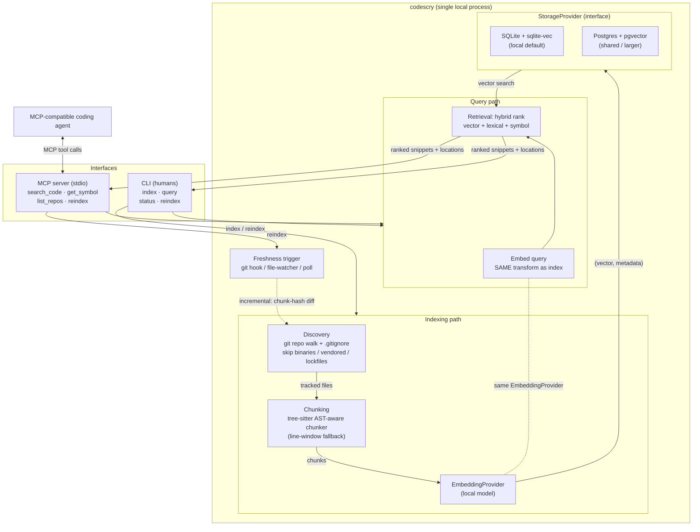

# Software Engineering Design Document (SEDD)

*This document is the formal proposal and technical blueprint for `codescry`, a local codebase retrieval tool distributed to engineers. It aligns engineering and reviewing stakeholders on scope, design, and trade-offs, and is the artifact taken into Design Review.*

**Doc ID:** `20260626-codescry`
**Status:** In progress (Draft for Design Review)
**Category:** Developer Productivity / Internal Tooling
**Last updated:** Jun 26, 2026
**Owner:** *[Your name]*
**Reviewers:** *[TBD]*
**Related artifacts:** `PRD-codescry.md` (the originating PRD)
**Target Launch:** *[TBD — see Phased Rollout]*

> **Note on classification.** This is a software-engineering design, not an ML model design. We *consume* a pre-trained embedding model as a black box — there is no model we train, retrain, version, or monitor for drift. The hard problems are all software engineering: ingestion, chunking, a swappable storage abstraction, incremental indexing, ranking, and the MCP contract. `codescry` is a single, focused, independently useful **tool/component**, not a platform or a service.
>
> **Note on scope and SLAs.** This tool runs on an engineer's laptop. It is **not** a latency-critical production service. Production-grade SLAs and a centralized production observability stack therefore **do not apply** — applying them would be over-engineering. We hold the design to the PRD's own local targets instead (p95 ≤ 500ms warm query, ≤ 60s freshness). The "what changes if this graduates to a shared service" path is captured in §8 and §9.

---

# 1. Problem Statement

## 1.1 Need

Coding agents are only as good as the context they are given. Today, when an agent needs code that spans repos it relies on keyword grep (which misses semantically-related code using different vocabulary), or on the engineer manually locating and pasting files (tedious, and it burns the agent's limited context window on irrelevant material). There is no persistent, queryable, semantic index, so the same code is re-discovered every session.

This is a developer-velocity problem. The leverage is broad and shallow: a small tool that makes engineers measurably faster in unfamiliar code, on every agent-assisted task. It also lowers the barrier to entry when onboarding into a new or unfamiliar codebase.

The pain is corroborated by the field: agents on large codebases routinely hit context-window limits and hallucinate APIs, conventions, and architectural decisions they have no way to know, and a local retrieval layer that fetches only relevant code before the agent acts is the standard mitigation (SitePoint, *Local RAG for Agents*).

## 1.2 Success Metrics

> **Note.** The PRD is honest that **no baseline exists** for "how long does it take to find the right code." Establishing that baseline (the golden eval set + a productivity baseline) is **Phase 0 and is a hard gate** — without it we cannot prove impact, and the project is not done until we can show the targets are met. These targets are *hypotheses to validate*, not commitments.

| Metric Type | Measurement | Target (The "Bar") |
| :--- | :--- | :--- |
| **North Star (Quality)** | Recall@10 on a curated golden "query → expected file/symbol" eval set | ≥ 0.85 |
| **Quality (Precision)** | Top-5 results judged relevant (LLM-judge or manual sample) | ≥ 70% |
| **Productivity** | Median time / manual file-pastes to assemble agent context vs. baseline | ≥ 50% reduction |
| **Latency** | p95 query latency, warm index, local | ≤ 500 ms |
| **Freshness** | Lag between a commit and that change being queryable | ≤ 60 s (incremental) |
| **Throughput** | Cold full index of a ~100k LOC repo | ≤ 10 min |
| **Adoption** | Engineers with the MCP wired into their agent after 4 weeks | ≥ 5 engineers |

> Recall@10 is a **proxy** for "the agent did better work." Triangulate it with the productivity metric and one qualitative signal (do people keep it turned on?). Don't optimize the proxy into the ground.

---

# 2. Prior Art (Grounding the Design)

This design is grounded in current, real-world implementations rather than first principles. The convergent patterns:

- **CocoIndex** (`dev.to/cocoindex`) — Tree-sitter syntax-aware chunking; **incremental processing** (only re-process what changed) for near-real-time freshness; local SentenceTransformer embeddings; Postgres + `pgvector` with cosine similarity. Key correctness lesson: **the embedding transform must be identical on the index and query paths** or vectors aren't comparable.
- **SitePoint, *Local RAG for Agents*** — local embeddings (Ollama + `nomic-embed-text`) so code never leaves the machine; function-aware chunking; **content-addressed chunk IDs** + file-path metadata; file-watcher re-indexing; middleware that injects retrieved context into the coding agent; hybrid (keyword + semantic) search; optional cross-encoder rerank improves accuracy at a latency cost.
- **Google Cloud Vertex AI RAG Engine** (`medium.com/google-cloud`) — a fully **managed, hosted** pipeline: code staged to a cloud bucket and embedded by a hosted model (`text-embedding-005`), `chunk_size≈500 / overlap≈100`, `similarity_top_k=10`. **We reject this topology** (it violates hard constraint C2) but borrow its sane chunk/top-K starting parameters.
- **psiace, *RAG in Coding Agents*** — the "**when to retrieve**" framing (retrieve on-demand for specific problems) and knowledge tiering. This informs why retrieval is an **agent-invoked MCP tool** rather than always-on middleware: the agent decides when grounding is worth a call.

---

# 3. High-Level Design & Architectural Boundary

## 3.1 Proposed Solution (Conceptual Overview)

`codescry` is a local Python application with two faces over one core engine:

1. An **MCP server** (the primary interface) that a local coding agent calls to self-serve ranked code snippets.
2. A thin **CLI** (the secondary interface) for humans to index, query, and check status.

The core engine is a pipeline:

**Flow:** discover git repos under a configured root → walk tracked files (respect `.gitignore`, skip binaries/vendored/lockfiles) → chunk each file by AST → embed each chunk **locally** → persist `(vector, metadata)` behind the `StorageProvider` interface. On change, diff chunk content-hashes against stored hashes and re-embed only changed chunks. On query, embed the query with the **same** transform, run hybrid ranking, return ranked snippets with file path + line range.

## 3.2 Architectural Boundary & Ownership

- **Boundary.** This is a self-contained **internal developer tool** with a single owner. It has no runtime coupling to any production service.
- **Encapsulation.** Internal complexity is hidden behind two interfaces:
  - The **MCP tool schema** is the sole contract with agents (capabilities, not CRUD on internals).
  - `StorageProvider` and `EmbeddingProvider` are internal seams that let storage/model implementations change without touching business logic or the MCP contract. *Programming to these interfaces is constraint C3, and it is the standard "program to interfaces, not implementations" practice.*
- **System of record.** **None is created.** The index is **read-only derived data** (PRD non-goal N2). **The git repositories remain the source of truth for code.** A corrupt or lost index is a *rebuild event, never a data-loss event.* This is the single most important architectural property — it removes this tool from the entire class of source-of-truth/consistency risks and means it needs no backups, no durability guarantees, and no reconciliation logic.

---

# 4. Detailed Deep Dive

## 4.1 Data Model

A single logical record per chunk. (Concrete columns/types live in the storage implementation; this is the contract the engine depends on.)

| Field | Type | Notes |
| :--- | :--- | :--- |
| `chunk_id` | string (content-addressed) | Hash of `repo_id + path + chunk_content`. Enables incremental re-embed: unchanged content → unchanged id → skip. |
| `repo_id` | string | Local checkout namespace key for the laptop index — canonical resolved repo root path in v1 (see Decision 7). |
| `path` | string | Repo-relative file path. |
| `language` | string | Detected from extension; drives the tree-sitter grammar. |
| `symbol_name` | string \| null | Enclosing function/class/endpoint, when the AST yields one. |
| `start_line` / `end_line` | int | For token-efficient snippet return + agent navigation. |
| `commit_sha` | string | The commit the chunk was indexed at — powers freshness/staleness reporting. |
| `content` | text | The chunk text (the snippet). |
| `embedding` | vector | Fixed dimension per the chosen embedding model. |

No new business object is created and no interpretation logic is owned — derived index only.

## 4.2 Key Design Decisions (the real forks from PRD §8)

> Each fork below gives ≥2 options with Pro/Con and a defended recommendation. **These are recommendations for Design Review to validate, not unilateral decisions.**

### Decision 1 — Embedding provider *(the dominant decision; hard constraint C2)*

| Option | Pros | Cons |
| :--- | :--- | :--- |
| **A. Local / self-hosted model** *(e.g., a code-tuned open model served via Ollama, or `sentence-transformers` in-process)* | Code never leaves the machine — satisfies C2 by construction; no network on the query path (C1); zero per-query cost | Quality may trail frontier hosted models; consumes local RAM/CPU/GPU |
| **B. Hosted embedding endpoint** *(e.g., Vertex `text-embedding-005`, as in the Google Cloud article)* | Highest embedding quality; no local compute | **Sends source code to a third party — violates C2** unless the endpoint is formally vetted/approved; adds network + cost to indexing |

**Recommendation: Option A (local), behind an `EmbeddingProvider` interface.** C2 is a *hard security constraint* and source code is proprietary; the security posture decides this, and "the index store is local; code never leaves the machine" is the corroborated standard for exactly this use case. Option B is permitted **only** behind a documented security sign-off and is not the default. Programming to `EmbeddingProvider` means a future approved endpoint is a config change, not a rewrite.

> **Action for review:** confirm whether *any* hosted endpoint is pre-approved for source code. If not, A is the only compliant path for v1. Treat this as the one decision needing a human security sign-off (never index secrets — see §5.3).

### Decision 2 — Vector store

| Option | Pros | Cons |
| :--- | :--- | :--- |
| **A. SQLite + a vector extension** (e.g., `sqlite-vec`) — *default* | Zero-setup, single file, in-process; ideal for the solo/laptop case; Chroma-on-SQLite is field-proven to low-hundreds-of-thousands of chunks | Not intended as a production datastore; scaling/concurrency ceiling for shared use |
| **B. Postgres + `pgvector`** — *shared/larger* | Proven, widely-used relational store; handles larger corpora and multi-user; CocoIndex's exact pattern | Requires a running Postgres; heavier setup |
| **C. Dedicated vector DB** (Pinecone/Weaviate/Qdrant) | Best-in-class ANN at very large scale | **Fails the "choose boring technology" test** for a local tool; new infra; over-engineered for v1 |

**Recommendation: A and B, both behind `StorageProvider`** (exactly constraint C3). SQLite is the zero-setup default for the local persona; Postgres is the documented path for "bigger/shared." **Reject C** for v1 — it needs a 10x justification we don't have, and Postgres+`pgvector` is sufficient and proven.

> **Note:** SQLite isn't a typical production store, but this is a *local tool*, and "fit for purpose over dogma" wins here — the value is zero-setup. If this graduates to a shared service, Postgres becomes the standard and SQLite is dropped to "local dev only."

### Decision 3 — Chunking strategy

| Option | Pros | Cons |
| :--- | :--- | :--- |
| **A. Fixed-size line/byte windows** | Trivial to implement; language-agnostic | Splits functions mid-body; materially worse retrieval; "random 500-char chunks" are widely reported as low-value |
| **B. AST / tree-sitter semantic chunking** | Chunks align to functions/classes/logical blocks → better retrieval & context; symbol names fall out for free (feeds `get_symbol`); the consensus quality lever in both CocoIndex and SitePoint | More work; needs a grammar per language; fallback needed for unsupported languages |

**Recommendation: B (tree-sitter) as the target**, with A as the **Phase-1 walking-skeleton shortcut only** (explicitly tracked as debt, see §7). For unsupported languages, fall back to a recursive window splitter (tree-sitter's own behavior when a language is unknown). Starting parameters to tune against the eval set: ~`500 token` target chunk size with ~`100 token` overlap (Google's defaults; CocoIndex uses larger windows — this is an eval-driven knob, not a guess to lock in).

### Decision 4 — Retrieval ranking

| Option | Pros | Cons |
| :--- | :--- | :--- |
| **A. Pure vector (cosine top-K)** | Simplest; sufficient for the walking skeleton | Misses exact identifier/symbol matches that lexical search nails |
| **B. Hybrid: vector + lexical (BM25/grep) + symbol match, blended** | Consistently beats pure-vector for **code** specifically; handles both "concept" and "exact name" queries | More moving parts; needs a blend/weighting |
| **C. Hybrid + cross-encoder rerank** | Highest precision | Reranking adds latency per query — risks the ≤500ms target; extra model to run |

**Recommendation: A for Phase 1, B for Phase 3** (the quality phase). Use a simple, explainable linear blend first; only add **C (rerank)** if the eval set shows we miss Recall@10 ≥ 0.85 without it, and only if it stays inside the latency budget. Don't pay the rerank latency tax until the eval data says it's needed.

### Decision 5 — Freshness mechanism

| Option | Pros | Cons |
| :--- | :--- | :--- |
| **A. Git post-commit / post-merge hook** | Fires exactly on the events that change indexed state; cheap; deterministic | Per-repo hook install; misses non-commit edits (dirty working tree) |
| **B. File-watcher** (e.g., `watchdog`) | Catches every save → closest to "real-time"; matches editor-driven updates | More event noise; needs debouncing; a long-running watcher process |
| **C. Periodic poll** (diff HEAD on a timer) | Dead simple; no hooks | Up to one interval of staleness; wasteful on idle repos |

**Recommendation: A (git hook) as primary + opt-in B (watcher)**, with C as a low-frequency safety net. This combination meets the ≤60s freshness target while keeping the common path cheap; incremental chunk-hash diffing (Decision 6) makes any of these inexpensive.

### Decision 6 — Incremental re-embed cost

**Decision (no real alternative): chunk-level content-addressed IDs.** On change, recompute chunk hashes for the changed files only (found via `git diff` against the stored `commit_sha`), then re-embed only chunks whose hash changed. This is the "content-addressed IDs" / "incremental processing" pattern from SitePoint and CocoIndex and is what makes the ≤60s freshness and ≤10min cold-index targets achievable. (Sanity check on feasibility: a small local model embeds on the order of ~100 chunks/sec on CPU, so a ~100k LOC cold index in ≤10 min is plausible; **benchmark in Phase 2** rather than trust the back-of-envelope.)

### Decision 7 — Multi-repo identity

**Decision: namespace v1 by local checkout path.** For the local SQLite index, `repo_id` is the canonical resolved repo root path. Store sanitized `remote_url` as display/debug metadata, not as the primary key. This avoids collisions between multiple local checkouts or worktrees of the same remote while keeping cross-repo results attributable (U1/U3). If this graduates to a shared service, repo identity needs a separate design using normalized remote URL plus clone/worktree identity. Multi-branch indexing is **deferred to P2** (single-branch in v1 — tracked debt, §7).

## 4.3 API / Interface Contract

> **Note on protocol.** Constraint C5 mandates **MCP**, which is a JSON-RPC protocol over stdio/HTTP. MCP is the correct, non-negotiable interface for an agent tool — effectively a control-plane (request/response) interface, not a hot data path. No alternative protocol is a better fit for an agent contract.

**Transport:** **stdio** for v1 (local agents run an MCP server as a child process over stdio). HTTP/SSE transport is deferred to the shared-service future (§9).

**MCP tools (the contract — final schemas locked in implementation, versioned):**

| Tool | Input | Output | Notes |
| :--- | :--- | :--- | :--- |
| `search_code` | `query` (str), `repo?`, `path_prefix?`, `language?`, `k?` | ranked list of `{repo, path, start_line, end_line, snippet, score}` | **Token-efficient: snippets + locations, never whole files.** The agent fetches full files itself only if needed. |
| `get_symbol` | `name` (str), `repo?` | `{repo, path, start_line, end_line, definition}` | Backed by `symbol_name` from AST chunking. |
| `list_repos` | — | `[{repo_id, last_commit_sha, indexed_at, chunk_count, is_stale}]` | Surfaces freshness so stale results are visible (risk mitigation). |
| `reindex` | `repo?` | `{status, chunks_changed, duration_ms}` | Triggers incremental refresh; full rebuild via a flag. |

**CLI (humans):** `index`, `query`, `status`, `reindex` — same engine, same results as the MCP path.

**Versioning:** tool schemas are explicitly versioned with backward-compatibility guarantees (PRD P1; contract-first, backward-compatible design). Additive changes only within a major version; breaking changes bump the major and keep the old tool name for a deprecation window. **A schema field that an agent depends on is a published contract — treat it like one.**

**Correctness invariant (do not violate):** the query path **must** embed with the exact same `EmbeddingProvider` + model + version used at index time. We enforce this by storing the embedding model id/version with the index and refusing (or auto-reindexing) on mismatch. This is the CocoIndex lesson — divergent embeddings silently destroy recall.

## 4.4 Technology Selection

| Concern | Choice | Rationale |
| :--- | :--- | :--- |
| Language | **Python 3.12** (pytest) | Weight sits in embeddings, tree-sitter bindings, and vector libs — all Python-strong; official MCP Python SDK. (Go was the alternative for a daemon, but the ecosystem fit favors Python; constraint C4 is soft.) |
| Agent interface | **MCP over stdio** | Mandated by C5; the correct protocol for agent tools (see §4.3). |
| Vector store (local) | **SQLite + `sqlite-vec`** | Zero-setup; field-proven at this scale. Not for production services. |
| Vector store (shared) | **PostgreSQL + `pgvector`** | Proven, widely-used; CocoIndex's pattern. |
| Embeddings | **Local code-tuned model** behind `EmbeddingProvider` | Satisfies C2 (data isolation); hosted endpoint only behind security sign-off. |
| Chunking | **tree-sitter** | Mature, multi-language, incremental parser; "boring"/proven. |
| Lint/format | **Ruff** | Fast, consistent linting/formatting in CI. |
| Packaging/distribution | **`pipx`-installable package + version tags** | This is a *distributed tool*, not a deployed service, so a service CI/CD deploy pipeline does not apply. CI (tests, lint, dependency/secret scan) still runs on the repo. |
| Observability | **Local structured logging + `status`** | A laptop CLI logs locally; a centralized production observability stack is for deployed services. The shared-service future adopts a standard stack (§9). |

---

# 5. Reliability, Scaling, and Operations

## 5.1 Scalability

Horizontal scaling is **not** a v1 concern (single-user, single-process). The relevant scaling axis is **corpus size**: the `StorageProvider` seam is the lever — SQLite for a laptop's worth of repos, Postgres+`pgvector` when the corpus or user count grows. Indexing is embarrassingly parallel across files; bound concurrency to avoid starving the developer's machine.

## 5.2 Failure Handling & Graceful Degradation

- **Per-file failure isolation:** a parse/embed failure on one file logs with context and continues — it must never abort the whole run (PRD 7.2; standard defensive coding: catch specific errors, log with context, never swallow).
- **Retrieval degradation:** if semantic retrieval is unavailable (e.g., embedding model can't load), **fall back to lexical/grep** rather than returning nothing (PRD 7.2).
- **Index corruption:** because the index is derived data, the recovery path is *rebuild*, not restore. `status` surfaces staleness/corruption; `reindex --full` is the fix.
- **Determinism:** any sampling (e.g., eval subsampling, tie-breaking) must accept a **seed** — a ranking anomaly you can't reproduce is one you can't debug.

## 5.3 Security (the primary surface)

- **C2 enforcement:** local embeddings by default; no source code to unapproved third parties; no network on the query path (C1).
- **Never index secrets:** skip `.env`, key files, and credential blobs; integrate secret scanning at ingest; provide a config flag to hard-exclude known-sensitive repos/paths (PRD 7.1). The tool must not become a vector for exfiltrating secrets or PII.
- **Shared Postgres (if used):** least-privilege access and encryption at rest.

## 5.4 Observability (SLIs)

Local-appropriate golden-signal analogues, surfaced via `status` and structured logs:

- **Latency:** per-query p95 (target ≤ 500ms warm).
- **Freshness:** commit-to-queryable lag (target ≤ 60s); `is_stale` per repo.
- **Errors:** per-file index failures (rate), query errors.
- **Throughput/Saturation:** chunks indexed, cold-index duration, embedding queue depth.
- **Quality (offline):** Recall@10 / Precision on the golden set, run in CI as a regression guard.

---

# 6. Implementation & Launch Plan

> **Note on "rollout."** For a distributed tool, "rollout" is **adoption**, and "rollback" is *don't ship the version that regresses the eval set.* The release gate is the golden eval set, not production traffic.

## 6.1 Phased Delivery (from PRD §12, with exit gates)

- **Phase 0 — Baseline & eval set.** 30–50 golden `query → expected file/symbol` pairs from real repos; capture the productivity baseline on ~5–10 representative tasks. **Exit (hard gate): a measurable baseline exists.**
- **Phase 1 — Walking skeleton.** Index one repo (SQLite), naive line-window chunking, semantic `search_code` over MCP, CLI query. **Exit: an agent retrieves real code end-to-end.**
- **Phase 2 — Fresh & multi-repo.** Incremental git-aware re-index (chunk-hash diff), multi-repo discovery, filters, freshness trigger. **Exit: ≤60s freshness met across a directory of repos; benchmark cold-index throughput.**
- **Phase 3 — Quality.** Swap to tree-sitter chunking; hybrid retrieval + `get_symbol`; tune against the eval set. **Exit: Recall@10 ≥ 0.85 (North Star met).**
- **Phase 4 — Hardening / share readiness.** CI, install docs, `doctor`, structured status, and best-effort secret exclusion verified. **Exit: ready to share beyond the author.** Postgres is deferred to a separate shared-service design.

## 6.2 Testing Strategy (the Testing Pyramid)

- **Unit (~70%)** — chunk-boundary logic, chunk-hash/diff logic, `repo_id` derivation, rank blending, snippet/line-range extraction. State inputs/outputs directly (DAMP); no logic in tests.
- **Integration (~20%)** — exercise the real SQLite store and real CLI/MCP-adjacent paths. If Postgres returns in a shared-service design, add a `StorageProvider` conformance suite that runs against real SQLite and real ephemeral Postgres. Embedding consistency (index vs query) gets an explicit test.
- **E2E (~10%)** — index a fixture repo → query over the **real MCP transport** → assert the expected snippet/symbol is returned. One test per critical path (`search_code`, `get_symbol`, incremental reindex).
- **Quality regression gate** — the golden eval set runs in CI; a drop in Recall@10 below target **fails the build**. This is the "rollback threshold" equivalent.

## 6.3 Rollback / Release Safety

- Versioned, `pipx`-installable releases; users pin a version. A bad release is rolled back by pinning the prior tag.
- The eval-set CI gate prevents shipping a quality regression in the first place.
- No data-loss risk on rollback — the index is rebuildable derived data.

---

# 7. Technical Debt / Future Refactoring

> Naming shortcuts now keeps them from rotting silently. Reserve a standing slice of capacity each cycle to pay these down rather than letting them accumulate.

| Known shortcut (v1) | Why acceptable now | Plan to retire |
| :--- | :--- | :--- |
| **Naive line-window chunking** in Phase 1 | Fastest path to an end-to-end skeleton | Replaced by tree-sitter in Phase 3 (Decision 3) |
| **Single-branch indexing** | Covers the dominant workflow | Multi-branch is P2; namespace already carries `commit_sha` to make it tractable |
| **No auth / single-user** | Local-first non-goal (N1) | Revisited only if this graduates to a shared service (§9), which warrants its own design doc |
| **SQLite as a backend** | Zero-setup value for the laptop persona | Postgres becomes the standard if shared; SQLite demoted to local-dev-only |
| **Local logging only** | No production SLA on a laptop tool | Adopt a centralized observability stack at shared-service graduation |

**Toil reduction:** indexing, freshness, and the eval run are all automated (no manual reindex step in steady state) — anything done repeatedly should be scripted, not done by hand.

---

# 8. Open Questions / Dependencies

**Open questions for Design Review:**
1. **Embedding provider sign-off (blocking):** is any hosted embedding endpoint pre-approved for source code, or is local mandatory for v1? (Decision 1.)
2. **Target agents:** confirm the v1 consumer set so we validate the stdio MCP contract against each (PRD dependency).
3. **Specific local embedding model:** pick by **benchmarking candidates against the golden eval set**, not by reputation — deliberately deferred so the data decides (kept behind `EmbeddingProvider`).
4. **Adoption target tracking:** measure whether ≥5 engineers wire the MCP into their agent after 4 weeks.
5. **Rerank:** include a cross-encoder reranker only if Phase 3 eval data shows we miss Recall@10 without it *and* it fits the latency budget.

**Dependencies:**
- MCP client support confirmed in the target agent(s).
- A vetted/approved embedding endpoint **only if** Option 1B is pursued (gated by a security review).
- A Postgres instance **only** for a future shared-service path, not v1 local hardening.

---

# 9. Appendix: The Graduation Path (if it proves out)

`codescry` is deliberately incubated as a local tool to maximize iteration speed and localize the blast radius of any failure. **If** local value is proven (adoption + sustained eval quality), a *separate* design doc would cover graduation to a shared, multi-user service — at which point auth/RBAC, a managed Postgres datastore, a centralized observability stack, a standard CI/CD deploy pipeline, and an HTTP/SSE MCP transport all become required. We do **not** build any of that now; pulling shared-service complexity into v1 is the premature-abstraction trap and adds coordination overhead with no v1 payoff.

---

## References
- CocoIndex — *Build Real-Time Codebase Indexing for AI Coding Agents* — https://dev.to/cocoindex/build-real-time-codebase-indexing-for-ai-coding-agents-5eb2
- Google Cloud — *Build a RAG system for your codebase in 5 easy steps* — https://medium.com/google-cloud/build-a-rag-system-for-your-codebase-in-5-easy-steps-a3506c10599b
- psiace — *RAG in Coding Agents* — https://psiace.me/posts/rag-in-coding-agent/
- SitePoint — *Local RAG for Agents: Integrating Private Knowledge Bases with Awesome-LLM-Apps* — https://www.sitepoint.com/local-rag-for-agents-integrating-private-knowledge-bases-with-awesomellmapps/
